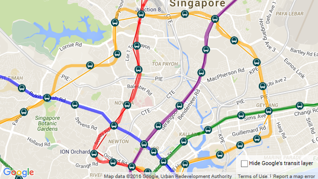

RailRouter SG
===

Yes I know, weird name. Following the same mistake I did for [BusRouter.SG](https://github.com/cheeaun/busrouter-sg).

This is a web app to show the MRT and LRT rail routes in Singapore. It's meant to [scratch my curiosity itch](https://twitter.com/cheeaun/status/683495506031448064) for comparing the *real* route lines VS the lines shown on Google Maps, which I personally find too *straight* and skews the perception of how trains actually travel in the real world. Yeah, kind of like the feeling of being trolled by Google Maps. Get it?

Anyway, these are features available:

- *Real* rail route lines.
- Checkbox to hide Google's own transit layer.
- Show station names in Chinese and Tamil if available, besides English.

That's it.

Technicalities
---

The *real* route lines come from OpenStreetMap here: http://wiki.openstreetmap.org/wiki/Mass_Rapid_Transit_%28Singapore%29

The JSON files are in `data` folder. `all.json` is for *all* routes and stops, while other files are individual lines.

Here's a sprinkle of NPM magic:

- `npm install` - install everything
- `npm run lines` - scrape the lines from OpenStreetMap
- `npm run compile` - generate `all.json`
- `npm run serve` - run a local server

License
---

http://cheeaun.mit-license.org/
