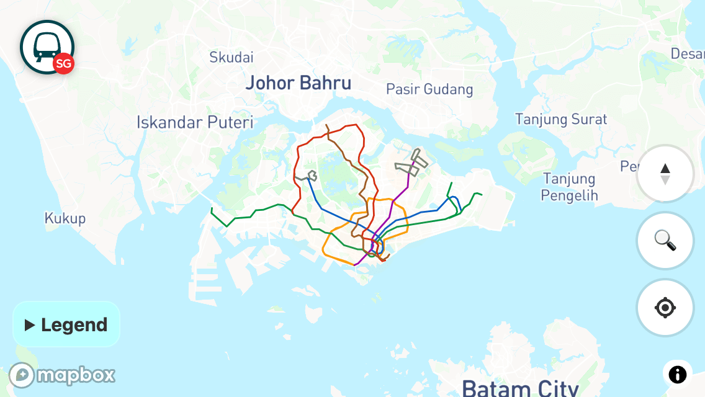
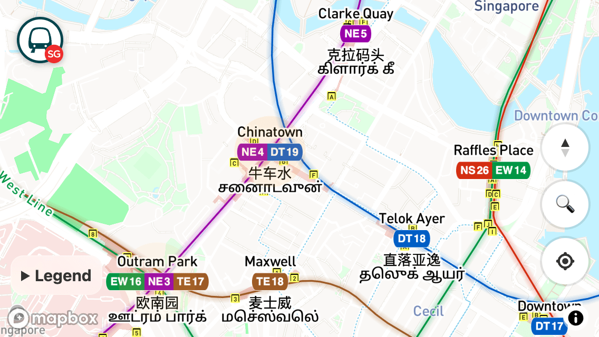
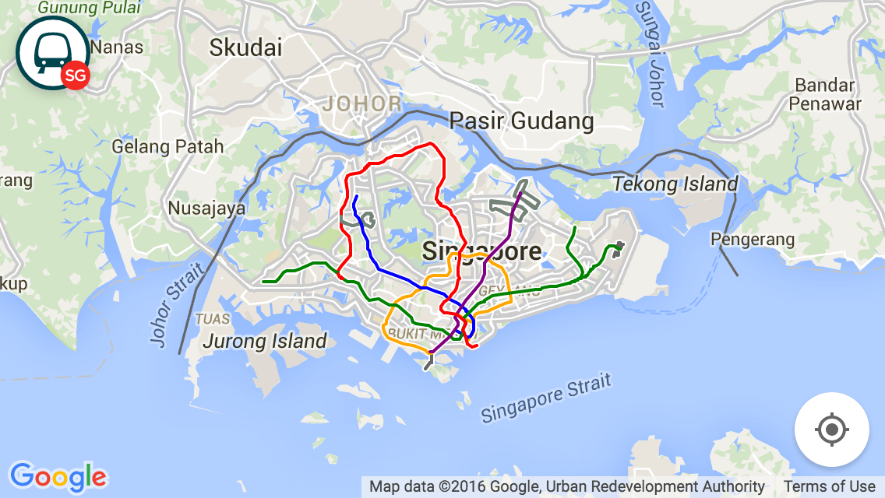

# RailRouter SG

**RailRouter SG** is a **progressive web app** that lets you explore MRT and LRT rail routes in Singapore.

It was built to [scratch my curiosity itch](https://twitter.com/cheeaun/status/683495506031448064) for comparing the _real_ route lines VS the lines shown on Google Maps, which I personally find too _straight_ and skews the perception of how trains actually travel in the real world.

Available features:

- **Real** rail route lines, for all train routes.
- Show station names in Chinese and Tamil, besides English.
- Show station building structures, both underground and aboveground.
- Show location of exits (a.k.a. entrances) for (almost) all stations.
- Show train arrival times for _some_ stations.
- Possibly, **works offline**.

## Previously

This is the first version, using Google Maps.

## Technicalities

### For development

- `npm i` - install dependencies
- `npm start` - starts the server
- `npm run build` - builds the production assets for deployment

### Data source

From my other repo: **[cheeaun/sgraildata](https://github.com/cheeaun/sgraildata)**.

⚠️ NOTE: All feature `id`s are removed from `sg-rail.geo.json` in this repo, due to a strange bug in Mapbox GL JS. If the `id` number is too large, errors occur.

### Generating station code markers

1. Go to https://codepen.io/cheeaun/full/pogQjgV
2. Paste all the train codes. (`/data/raw/sg-stations-codes.txt` from `sgraildata` repo)
3. Click "Generate Images" button to download ZIP file of SVG images.
4. Extract files from the ZIP file.
5. Go to https://www.facetstudios.com/sprite-generator
6. Drag/Upload all SVG files to the site.
7. Uncheck "Export for retina". Check "Generate JSON".
8. Click "Download Files" button.
9. Extract files from ZIP file.
10. Move & rename sprite image to `src/stations.png`. Optimize the image with [TinyPNG](https://tinypng.com/).
11. Move & rename sprite JSON to `scripts/sprite.json`.
12. Run `node scripts/gen-stations-sprite.js` which will generate `src/stations.json`.

## License

- Data: © [LTA](https://www.lta.gov.sg/content/ltagov/en/terms-of-use.html) © [Data.gov.sg](https://data.gov.sg/privacy-and-website-terms#site-terms) © [SMRT](https://www.smrt.com.sg/Terms-of-Use) © [SBS](https://www.sbstransit.com.sg/conditions-for-use)
- Everything else: [MIT](http://cheeaun.mit-license.org/)
